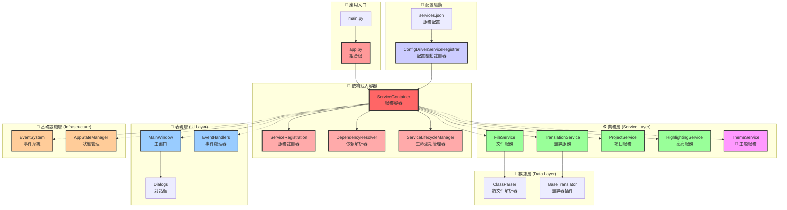

# CLASS Translator

本專案全程使用 Gemini 2.5 Pro 以及 Claude Opus 4 開發。

## 🎯 項目概述

CLASS Translator 是為 J2ME 設計的 Class 翻譯工具。

使用現代化的企業級架構，支持依賴注入、事件驅動和配置驅動等高級模式，為開發者提供了高效、穩定的解決方案。

### 🎆 主要優勢

- **🔧 專業工具**: 專門針對 Java Class 文件的字符串編輯優化
- **🏢 企業級架構**: 採用現代軟體架構模式，易於維護和擴展
- **🚀 高效性能**: 工程保存和批量處理，大幅提升工作效率

## ✨ 核心特性

### 🌐 翻譯系統
- **插件化架構**: 支持動態加載翻譯器插件
- **Google翻譯支持**: 内建輕量級Google翻譯引擎
- **並發控制**: 可配置並發翻譯請求數量

### 📁 項目管理
- **工程文件**: 支持保存和加載完整的翻譯項目(.cep格式)
- **狀態顯示**: 顯示加載的文件數量和字符串總數
- **無損保存**: 工程文件不修改原始.class文件

## 🏗️ 架構設計

本項目實現了高度的模塊化、可擴展性和可維護性：

### 核心架構圖



### 依賴注入系統

項目透過 **服務容器** 管理所有服務的生命週期和依賴關係。

#### 容器架構優勢
- 解耦合：`app.py` 不直接創建服務，而是通過容器管理
- 可配置：通過 `services.json` 配置文件動態註冊服務
- 可測試：容易替換服務實現進行單元測試
- 可擴展：新增服務不需修改主應用類

#### 核心組件
- ServiceContainer：服務容器核心，管理所有服務實例
- ServiceRegistration：服務註冊器，定義服務依賴關係
- DependencyResolver：依賴解析器，自動注入依賴
- ServiceLifecycleManager：生命週期管理器，支持單例/瞬時範圍
- ConfigDrivenServiceRegistrar：配置驅動註冊器，支持JSON配置完整的服務創建、初始化和銷毀管理

### 📁 目錄結構

```
CLASS編輯器/
├── main.py                    # 🚀 應用程序入口
├── app.py                     # 🏢 主應用類（依賴注入容器）
├── config.json                # ⚙️ 應用配置文件
├── config/
│   └── services.json          # 🔧 服務配置文件
├── core/                      # 🏗️ 核心模塊
│   ├── container/             # 📦 依賴注入容器
│   │   ├── service_container.py      # 服務容器核心
│   │   ├── dependency_resolver.py    # 依賴解析器
│   │   ├── service_lifecycle.py     # 生命週期管理
│   │   ├── service_config.py        # 配置管理
│   │   ├── config_driven_registrar.py # 配置驅動註冊
│   │   └── service_registration.py  # 服務註冊
│   ├── services/              # ⚙️ 業務服務
│   │   ├── file_service.py           # 文件處理服務
│   │   ├── translation_service.py   # 翻譯服務
│   │   ├── project_service.py       # 項目管理服務
│   │   ├── theme_service.py          # 🎨 主題服務
│   │   └── highlighting_service.py  # 語法高亮服務
│   ├── commands/              # 🎯 命令模式
│   │   ├── command_interface.py     # 命令接口
│   │   ├── command_invoker.py       # 命令調用器
│   │   └── ui_commands.py           # UI命令實現
│   ├── events/                # 📡 事件系統
│   │   ├── event_system.py         # 事件系統核心
│   │   └── ui_events.py            # UI事件定義
│   ├── state/                 # 📊 狀態管理
│   │   └── app_state_manager.py     # 應用狀態管理器
│   └── models/                # 📋 數據模型
│       └── string_entry.py          # 字符串條目模型
├── ui/                        # 🖥️ 用戶界面
│   ├── main_window.py               # 主窗口（組件化重構）
│   ├── event_handlers.py            # 事件處理器協調器
│   ├── components/            # 🧩 UI組件
│   │   ├── editor_view.py           # 編輯器視圖組件
│   │   └── file_tabs_view.py        # 文件標籤頁組件
│   ├── handlers/              # 🎮 事件處理器
│   │   ├── event_handler_coordinator.py # 處理器協調器
│   │   ├── ui_event_handlers.py     # UI事件處理器
│   │   ├── file_handlers.py         # 文件處理器
│   │   ├── translation_handlers.py # 翻譯處理器
│   │   ├── project_handlers.py      # 項目處理器
│   │   └── theme_handlers.py        # 🎨 主題處理器
│   ├── find_dialog.py               # 查找對話框
│   ├── find_replace_dialog.py       # 查找替換對話框
│   ├── settings_dialog.py           # 設置對話框
│   └── interfaces/            # 🔌 UI接口定義
│       └── imain_window.py          # 主窗口接口
├── parsers/                   # 📖 文件解析器
│   ├── base_parser.py               # 解析器基類
│   ├── class_parser.py              # .class文件解析器
│   ├── jar_parser.py                # .jar文件解析器
│   ├── text_parser.py               # 文本文件解析器
│   └── parser_factory.py            # 解析器工廠
├── translators/               # 🌐 翻譯器插件
│   ├── base_translator.py           # 翻譯器基類
│   └── light_google_translator.py   # Google翻譯插件
├── Azure-ttk-theme-main/      # 🎨 主題資源
│   └── azure.tcl                    # Azure主題定義
└── build.py                   # 🔨 構建腳本
```

### 基本使用

1. **📂 打開文件**: 點擊「打開目錄」選擇包含.class文件的目錄
2. **📝 編輯翻譯**: 在左側樹狀視圖中選擇要編輯的字符串條目
3. **🌐 自動翻譯**: 使用「批量翻譯」功能自動翻譯所有條目
4. **💾 保存修改**: 點擊「應用更改」保存修改到文件
5. **📋 項目管理**: 使用「保存工程」功能保存當前工作狀態

## 🔧 核心架構詳解

### 🏗️ 依賴注入容器系統

#### `ServiceContainer`
- **核心功能**: 企業級依賴注入容器，支持多種生命週期管理
- **生命週期類型**:
  - `SINGLETON`: 單例模式，全局唯一實例
  - `TRANSIENT`: 瞬態模式，每次請求創建新實例
  - `INSTANCE`: 實例模式，預註冊的具體實例
- **自動依賴解析**: 基於類型提示的構造函數注入
- **循環依賴檢測**: 防止服務間的循環依賴問題

#### `DependencyResolver`
- **智能解析**: 自動分析構造函數參數並解析依賴
- **依賴圖生成**: 可視化服務間的依賴關係
- **驗證機制**: 批量驗證所有服務依賴的正確性

#### `ServiceLifecycleManager`
- **狀態跟蹤**: 管理服務的完整生命週期狀態
- **事件處理**: 創建、初始化、銷毀事件的統一處理
- **資源管理**: 確保服務正確創建和安全銷毀

### 🔧 配置驅動架構

#### `ConfigDrivenServiceRegistrar`
- **JSON配置**: 通過`config/services.json`定義服務註冊
- **靈活註冊**: 支持類型、依賴、參數、生命週期的完整配置
- **動態加載**: 運行時根據配置動態創建服務實例

#### 配置文件結構
```json
{
  "services": [
    {
      "name": "FileService",
      "implementation": "core.services.file_service.FileService",
      "scope": "singleton",
      "dependencies": [],
      "parameters": {},
      "tags": ["core", "file"]
    }
  ]
}
```

### 🎯 事件驅動架構

#### `EventSystem`
- **發布/訂閱模式**: 解耦UI和業務邏輯的通信
- **線程安全**: 支持多線程環境下的事件處理
- **事件過濾**: 基於事件類型的智能路由

#### `CommandPattern`
- **統一接口**: 所有用戶操作實現`ICommand`接口
- **可撤銷操作**: 支持操作的撤銷和重做
- **批量執行**: 支持命令的批量執行和事務處理

### 📊 狀態管理系統

#### `AppStateManager`
- **集中狀態**: 統一管理應用的所有狀態數據
- **觀察者模式**: 狀態變化的自動通知機制
- **狀態持久化**: 支持狀態的保存和恢復

### 🎨 主題系統架構

#### `ThemeService`
- **主題管理**: 支持明暗兩種主題模式
- **Azure TTK 集成**: 使用 Azure-ttk-theme 提供現代化 UI 樣式
- **非-TTK 控件支持**: 手動管理標準 Tkinter 控件的主題色彩
- **事件驅動**: 通過 `ThemeChangedEvent` 通知 UI 組件更新

#### 主題配置
```python
# 淺色主題
"light": {
    "Text": {"background": "#FFFFFF", "foreground": "#000000"},
    "Highlight": {"background": "#E8F4FD", "foreground": "#1F5582"}
}

# 深色主題  
"dark": {
    "Text": {"background": "#2E2E2E", "foreground": "#FFFFFF"},
    "Highlight": {"background": "#3D5A80", "foreground": "#E0E6ED"}
}
```

#### 主題切換流程
1. **用戶點擊**: 頂部菜單欄的“🎨 主題”按鈕
2. **服務調用**: `ThemeService.apply_theme()` 方法
3. **TTK 更新**: 自動應用 Azure 主題樣式
4. **事件發布**: 發布 `ThemeChangedEvent` 事件
5. **UI 更新**: 所有訂閱者更新非-TTK 控件顏色

### 🔌 插件化架構

#### 翻譯器插件
- **抽象基類**: `BaseTranslator`定義統一接口
- **動態發現**: 自動發現和加載翻譯器插件
- **多引擎支持**: 同時支持多種翻譯服務

#### 解析器插件
- **可擴展性**: 支持新文件格式的解析器
- **統一接口**: 標準化的文件解析流程

### 🧪 測試驅動開發

#### 測試覆蓋
- **單元測試**: 每個核心組件都有對應測試
- **集成測試**: 驗證組件間的協作
- **配置測試**: 驗證配置驅動的正確性

#### 測試文件
- `test_service_container.py`: 服務容器功能測試
- `test_enhanced_dependencies.py`: 依賴管理測試
- `test_config_driven.py`: 配置驅動測試
  - `_on_highlight_toggle()`: 響應高亮復選框的點擊事件，調用 `HighlightingService` 更新狀態，並觸發UI刷新。
  - `_update_highlights()`: 核心高亮更新函數，在文本變更或條目選擇時被調用，協調 `HighlightingService` 和 `MainWindow` 完成高亮操作。

---

## 📖 使用指南

### 🎯 基本工作流程

#### 1. 📂 加載文件
```
文件 → 打開目錄 → 選擇包含.class文件的目錄
```
- 系統會自動掃描並加載所有.class文件
- 左側樹狀視圖顯示所有可翻譯的字符串條目
- 狀態欄顯示加載的文件數量和字符串總數

#### 2. ✏️ 編輯翻譯
- **單個編輯**: 點擊左側條目，在右側「譯文」框中編輯
- **批量選擇**: 使用 `Ctrl+Click` 或 `Shift+Click` 選擇多個條目
- **自動翻譯**: 點擊「批量翻譯」使用AI翻譯引擎
- **實時驗證**: 系統會自動檢測並高亮非EUC-KR字符

#### 3. 💾 保存工作
- **保存工程**: 推薦先保存為.cep工程文件（無損保存）
- **應用更改**: 將翻譯應用到原始.class文件
- **自動備份**: 系統會自動創建.bak備份文件

### 🔧 高級功能

#### 🔍 查找和替換
```
編輯 → 查找
編輯 → 查找替換
```
- 支持在原文和譯文中搜索
- 批量替換功能
- 區分大小寫選項

#### ⚙️ 翻譯設置
```
工具 → 翻譯設置
```
- 配置翻譯引擎（目前支持Google Translate）
- 設置並發翻譯數量
- 設置翻譯參數

#### 🎨 主題切換
```
頂部菜單欄 → 🎨 主題
```
- **一鍵切換**: 直接點擊即可在明暗主題間切換
- **實時生效**: 主題變更立即應用，無需重啟
- **智能適配**: 文本框和高亮顏色自動調整
- **護眼設計**: 精心調整的配色方案，減少眼部疲勞

#### 🔍 高級功能
```
視圖 → 高亮設置
```
- 啟用/禁用字符編碼高亮
- 自定義高亮顏色
- 調整字體大小

### 📋 工程文件管理

#### 創建工程
1. 加載.class文件
2. `工程 → 保存工程` 創建.cep文件
3. 選擇保存位置和文件名

#### 加載工程
1. `工程 → 加載工程` 選擇.cep文件
2. 系統自動恢復翻譯進度
3. 繼續編輯或應用更改

#### 工程文件優勢
- ✅ **無損保存**: 不修改原始文件
- ✅ **進度跟蹤**: 記錄翻譯狀態
- ✅ **團隊協作**: 可共享工程文件
- ✅ **版本控制**: 支持Git等版本控制

---

## 🏗️ 開發指南

### 構建可執行文件

```bash
# 安裝構建依賴
pip install pyinstaller

# 運行構建腳本
python build.py

# 可執行文件位於 dist/ 目錄
```

### 運行測試

```bash
# 運行所有測試
python -m pytest tests/

# 運行特定測試
python test_service_container.py
python test_enhanced_dependencies.py
python test_config_driven.py
```

### 添加新翻譯器

1. 在 `translators/` 目錄創建新文件
2. 繼承 `BaseTranslator` 類
3. 實現 `translate()` 方法
4. 系統會自動發現並加載

```python
from translators.base_translator import BaseTranslator

class MyTranslator(BaseTranslator):
    def translate(self, text: str) -> str:
        # 實現翻譯邏輯
        return translated_text
```

### 擴展文件格式支持

1. 在 `parsers/` 目錄創建新解析器
2. 實現文件解析和保存邏輯
3. 在服務配置中註冊新解析器

---

## 📄 許可證

本項目採用 MIT 許可證。詳見 [LICENSE](LICENSE) 文件。

---

## 🙏 致謝

- [Azure-ttk-theme-main](https://github.com/rdbende/Azure-ttk-theme) 的 Theme 支援
- Gemini 2.5 Pro 的宏觀遠景，以及 Claude Opus 4 的細緻入微